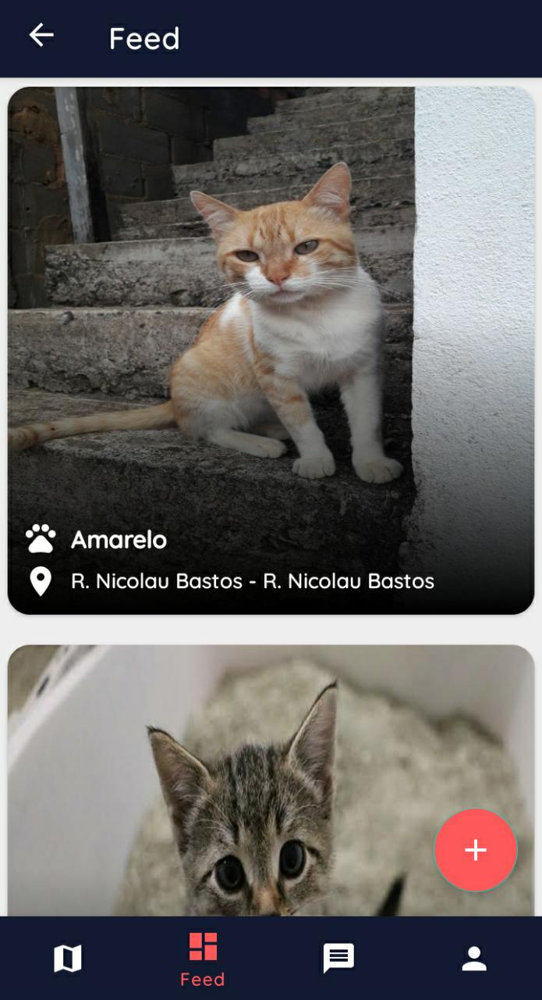

# Cade meu Pet

## Sobre o projeto

Uma ferramenta que auxilia no retorno de animais para seus antigo lares ou um novo, pois tambem tem a função de adoção.

 
 

Este projeto foi usado no meu TCC para graduação  de Bacharelado em Sistemas de Informação pela UniRedentor e tambem como portfólio pessoal.

## Tecnologias

- Kotlin
- Arquitetura MVVM
- Dagger Hilt
- Coroutines
- Firebase
- Google Maps API
- ViewBinding
- Navigation Component
